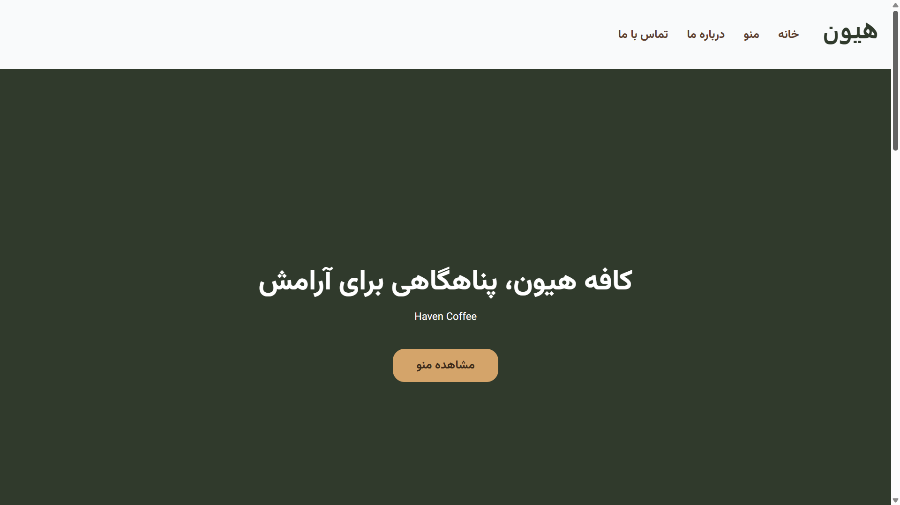
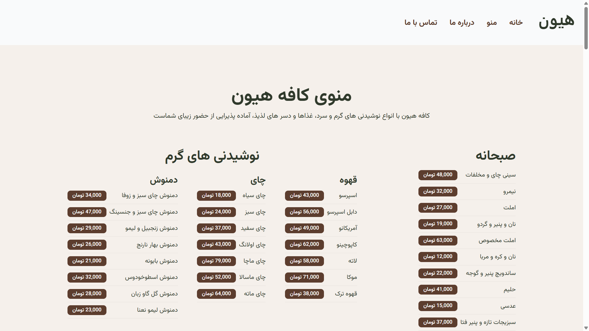
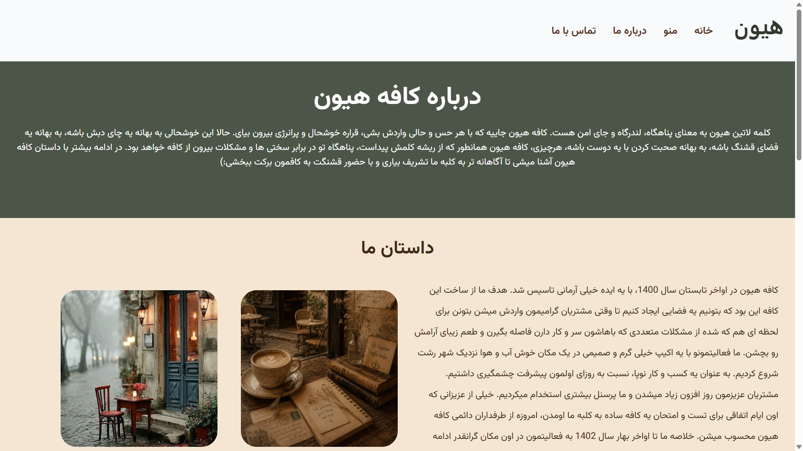
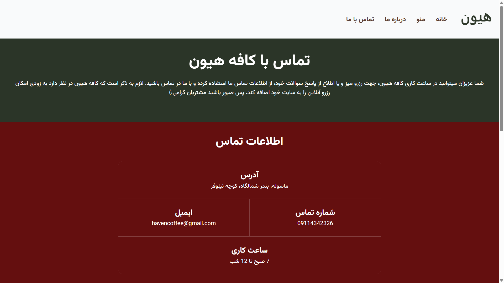

# Haven Coffee - وبسایت هیون

A static coffee shop website built with pure HTML & CSS. Fully responsive, no frameworks or extra tools — just the basics to practice core front-end skills and learn Git workflow properly.

**Live Demo:** [https://mehdirfi.github.io/haven-coffee/](https://mehdirfi.github.io/haven-coffee/)

## Technologies - تکنولوژی ها

- HTML5 (Semantic)
- CSS3 (Flexbox, Grid, Custom Properties)
- Figma (Design)
- Git & GitHub (Version Control)

## Features - قابلیت ها

- 4 pages: Homepage, Menu, About, Contact
- Fully responsive (Mobile, Tablet, Desktop)
- SEO-friendly (meta tags, canonical, Schema.org)
- Accessibility (ARIA attributes, semantic HTML, alt texts)
- Clean and maintainable CSS structure (base + per-page)

## Project Structure - ساختار پروژه

```
haven-coffee/
├── index.html
├── menu.html
├── about.html
├── contact.html
├── README.md
└── assets/
    ├── css/
    │   ├── base.css
    │   ├── homepage.css
    │   ├── menu.css
    │   ├── about.css
    │   └── contact.css
    ├── images/
    ├── videos/
    └── fonts/
```

## How to Run - نحوه اجرا

Just open `homepage.html` in your browser. No build step or server needed.

## Screenshots

### Homepage

### Menu

### About

### Contact


## Design - طراحی

### Homepage - صفحه اصلی

[Figma view link for the Homepage](https://www.figma.com/design/fvM3eZFHZjOvVZupBoHUmq/haven-coffee?node-id=0-1&t=Ilh5LfKUCo5cgFsz-1)

### Menu - منو

[Figma view link for the Menu](https://www.figma.com/design/fvM3eZFHZjOvVZupBoHUmq/haven-coffee?node-id=58-2&t=3b6JwxJoADhS3qf9-1)

### About - درباره ما

[Figma view link for the About](https://www.figma.com/design/fvM3eZFHZjOvVZupBoHUmq/haven-coffee?node-id=64-2&t=DIrVY1FP8nMub7Y8-1)

### Contact - تماس با ما

[Figma view link for the Contact](https://www.figma.com/design/jDb98bYBZXj3JlmShfBuMU/Untitled?node-id=0-1&t=v5qKQrXyrvwsKv5H-1)

## Author

**Mohammad Mahdi Arefi**
